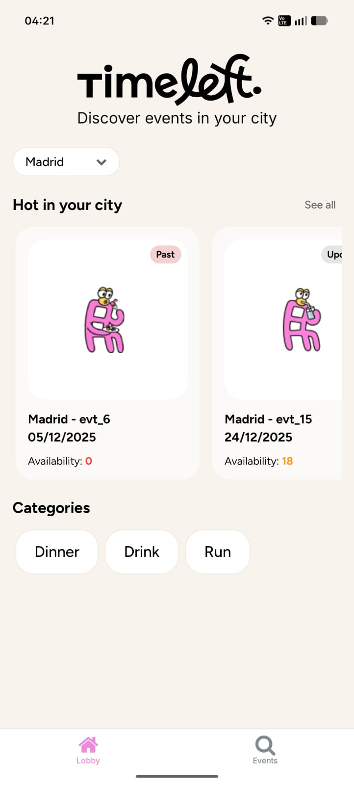
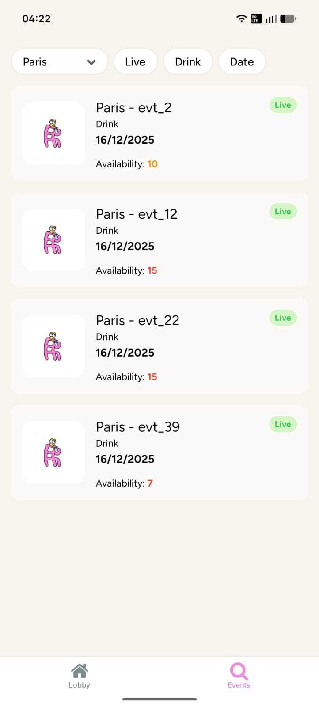
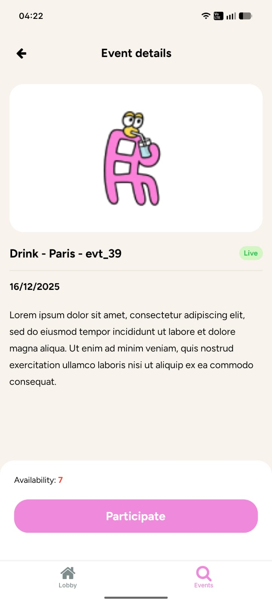
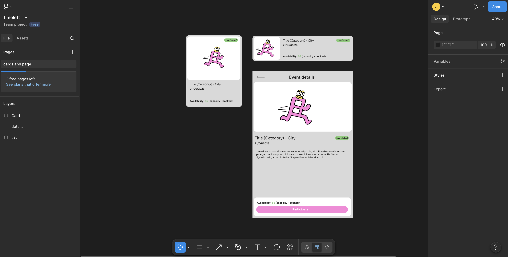

# TimeLeft — Events Discovery App

## Short challenge description

This challenge focuses on building a dynamic, high-performance Event Discovery screen that allows users to seamlessly browse, filter, and sort upcoming local activities. Driven by a live API, the interface must accurately parse core event parameters—including type, date, city zone, capacity, and status—while cleanly presenting high-level statistical overview metrics. Deep-dive navigation is integrated out of the box, allowing users to transition effortlessly from a dense list view into comprehensive event detail layouts. A critical aspect of the challenge lies in engineering a highly adaptive layout capable of performing flawlessly whether displaying a handful of local options or scaling up to over 1,000 events. Operating without finalized visual specs, the implementation relies on robust architectural judgment to deliver a premium aesthetic that balances massive data volatility with a top-tier user experience.

| Lobby | Events | Event details |
| :---: | :---: | :---: |
|  |  |  |

We value **clarity, strong mobile UX, code quality and maintainability, solid React Native practices, and thoughtful technical decisions**.

## Links

- **GitHub:** [timeleft-event-discovery-app](https://github.com/zebader/timeleft-event-discovery-app)
- **Prompt history:** [Google Doc](https://docs.google.com/document/d/1SB8LgSQN262erzcGaNn36NsPkq2JnTewWsj6wgUs4g4/edit?usp=sharing)

## Testing

To ensure application stability and reliability, a multi-tiered testing strategy was adopted. Unit testing isolates core logic by focusing on selectors, utility functions, and the base API client, while integration testing verifies the behavior of our custom React Query hooks using mocked CDN data. Automated end-to-end (E2E) smoke tests are handled via Maestro to validate the primary navigation flows, which is complemented by comprehensive manual testing executed across both iOS and Android devices using Expo Go to guarantee a seamless, real-world user experience.

To complement this testing strategy, a streamlined CI/CD pipeline can be automated via GitHub Actions to safeguard code quality and enforce development standards. The workflow is designed to trigger automatically on every pull request, executing our linting configurations, formatting checks, and the automated unit and integration test suites to ensure that only stable, fully verified code is ever merged into the main branch.

## How to run the project

The recommended way to start the project is with [Expo Go](https://expo.dev/go):

```bash
npm start
```

and choose to use it in the Expo app simulator scanning the QR or with the url, also pressing a opens android simulator or i iOS xCode simulator.

if mayor changes or new libraries were included i suggest use 

```bash
npm start -- --clear
```

## Decisions made

- The first step was to analyze the challenge and similar apps to conclude what would be the best UI decisions, listing out ideas and mapping how to solve the user stories with them.

- Then I created some low-fi wireframes on paper, adding features I thought would be useful for a user to achieve the best event experience, going a bit further than the MVP. In the end, some of those ideas didn't make it to the final presentation; I will list them later in the backlog section.

- After having the design on paper, I started with the project architecture. I decided to go with a feature-by-domain approach, keeping common tools (hooks, models, queries, etc.) used across features in a shared module, while each feature module has its own fixed structure (pages, ui, hooks, data-access, utils...). I think this architecture is very handy here to easily spot features and screens, making it easy to maintain and share.

- I continued by setting up the data layer and installing React Query. It's a fantastic library that easily handles caching with keys, statuses, etc. Since we are using a CDN JSON file for the API and services, my idea was to create a main query that fetches and caches all items, and then create public hooks using that query's select option to map the data, simulating different queries. This way, I can get categories, statuses, and details in their own wrapped hooks. **-> Here I missed the possibility of paginating the endpoint, which would have powered the virtualized list with FlashList, making it super resilient.**

- During this, I was adding all the new rules to AGENT.md so it could maintain the same workflow and respect the context and design decisions.

- Once the data layer was ready and tested, I started on the UI. I decided to create a Lobby and an Event list. To improve the DX and use a very solid option for styling, I went with styled-components, as it creates shareable blocks that can handle conditionals or other operations and directly use the "theme" from the mini design system I created, keeping things very consistent.

- As I started creating components for the screens, I realized the best approach would be to use Jotai for state management. This way, filters can be preserved across both pages, and atoms can be consumed only by the impacted UI elements to avoid unnecessary re-renders. I chose Jotai because it's incredibly easy to set up and use, making it a great fit for this project's filtering and sorting needs.

- I decided to use FlashList for the virtualized list since it's the standard nowadays; v2 helps a lot with layout calculations, and the recycling loop significantly improves performance. In this case, since the UI is usually pre-filtered to avoid massive lists, using FlashList might be a bit of an overkill, but if this project needs to handle 1,000+ items at some point, FlashList with pagination is definitely the best option.

- Then I added some lint rules and pre-commit hooks to improve and automate code formatting.

- Next, I used the designs I built in Figma to ensure consistency across the cards and the details page. Combining this with the theme tokens made it very easy to maintain the look and feel. **This was when I started to realize that it wouldn't be possible to add all the features I initially planned due to time constraints, so I decided to move forward with simpler filters and drop the search bar.**



- I added pull-to-refresh directly using the FlashList options, as I think it's clean and works smoothly.

- Finally, I finished implementing the remaining logic and UI, tested everything, and reviewed it with an AI agent to catch any potential bugs, code duplications, or leftovers.

- As a side note, I mainly used Cursor for its agent capabilities and Gemini to polish my prompts.

## What you would improve with more time (backlog)

- Backend Pagination & Filtering: In a real-world production app, I would have collaborated with the backend team to implement pagination and server-side filtering. Offloading this logic from the client side is essential to make the application truly scalable.

- Intermediary Search Flow: In my initial draft, I planned to add a search button that redirects to an intermediary filtering page before opening the main list. This would allow users to narrow down their criteria precisely before fetching a massive volume of items.

- Lobby Enhancements & Lazy Fetching: In the lobby, I would have added more distinct sections, diverse filters, or marketing banners. For optimal performance, I would have implemented lazy fetching, triggering queries only when the user scrolls to a specific pixel threshold.

- Urgency Countdown Timer: It would be a great UX feature to add a live countdown timer showing exactly how much time is left to register, creating a sense of urgency that encourages users to secure their spots.

- Real-Time WebSocket Integration: Integrating WebSockets for live event tracking would be an incredible addition, allowing seat availability numbers to change and sync across all clients instantly as users hit "Participate."

- Geolocation & Mapping: Adding native geolocation services and an interactive map view would provide a significantly more intuitive and localized user experience.

- Localization (i18n): Currently, all static text is hardcoded. I would ideally implement an internationalization framework to centralize all strings, making the codebase cleaner and ready for multi-language translations.

- Design System Expansion & Storybook: I would love to expand the shared component library and design system tokens (formalizing our typography scale, font weights, and spacing) and set up Storybook to document them so designers can interact with the components in isolation.

- Automated Testing: Implementing a robust testing suite, including unit tests for our data hooks, integration tests for filtering logic, and E2E tests for the primary navigation flows.

- Image Optimization CDN: To boost image rendering performance, I would integrate a service like Cloudflare Images to dynamically resize, compress, and serve assets perfectly optimized for the user's device viewport.

## Questions and conclusions

I really enjoyed working on this project and ended up spending quite a bit of time on it! Overall, I am very satisfied with how it turned out. I probably should have focused strictly on what could be accomplished within a standard 2-to-3-hour window, but to be honest, I had some extra time and preferred to push all these ideas together to build something much more tangible. Plus, I got a bit hooked on experimenting with Cursor to see just how far I could take the implementation.

It would have been nice if the API endpoint had included an event description or a bit more metadata to display directly on the cards. Additionally, it wasn't entirely clear from the brief what the primary action should be once a user lands on the details page—whether they should participate, purchase, or contact organizers. I took some creative liberties there, but I believe the final flow matches the project's purpose perfectly.

Best Regards

Jesus Cebader